# 🚀 AI-Powered Journey Analysis: processUserRegistration

**📁 Location:** test-ai-function.js:2
**🔍 Analysis:** AI-powered comprehensive code analysis

## 📊 EXECUTION FLOW DIAGRAM

```mermaid
graph TD
    U1["handleRegistrationRequest<br/>test-ai-function.js:76"] --> MAIN["processUserRegistration<br/>TARGET"]
    U2["registerUserFromAdmin<br/>test-ai-function.js:84"] --> MAIN
    MAIN --> D1["validateUserData<br/>test-ai-function.js:32"]
    D1 --> D1Purpose["Validates user input data for required fields and format"]
    MAIN --> D2["findUserByEmail<br/>test-ai-function.js:40"]
    D2 --> D2Purpose["Database query to check if user already exists"]
    MAIN --> D3["hashPassword<br/>test-ai-function.js:44"]
    D3 --> D3Purpose["Securely hashes password using bcrypt"]
    MAIN --> D4["createUser<br/>test-ai-function.js:48"]
    D4 --> D4Purpose["Inserts new user record into database"]
    MAIN --> D5["cacheUserData<br/>test-ai-function.js:52"]
    D5 --> D5Purpose["Stores user data in Redis cache for performance"]
    MAIN --> D6["sendWelcomeEmail<br/>test-ai-function.js:56"]
    D6 --> D6Purpose["Sends welcome email to new user"]
    MAIN --> D7["logEvent<br/>test-ai-function.js:64"]
    D7 --> D7Purpose["Logs registration event for analytics"]
    MAIN --> D8["publishEvent<br/>test-ai-function.js:68"]
    D8 --> D8Purpose["Publishes registration event to message queue"]
    
    classDef complexity1 fill:#ccffcc
    classDef complexity2 fill:#ffffcc
    classDef complexity3 fill:#ccffcc
    classDef complexity4 fill:#ffffcc
    classDef complexity5 fill:#ccffcc
    classDef complexity6 fill:#ffffcc
    classDef complexity7 fill:#ccffcc
    classDef complexity8 fill:#ccffcc
    
    class D1 complexity1
    class D2 complexity2
    class D3 complexity3
    class D4 complexity4
    class D5 complexity5
    class D6 complexity6
    class D7 complexity7
    class D8 complexity8
    
    MAIN --> API[API Endpoints]
    API --> API1["POST /api/register"]
    API --> API2["POST /api/admin/users"]
    
    MAIN --> DB[(Database)]
    DB --> DB1["findOne: users"]
    DB --> DB2["insertOne: users"]
    
    MAIN --> CACHE[Cache/Redis]
    MAIN --> MQ[Message Queue]
```

## ⬆️ UPSTREAM ANALYSIS (2 callers)

Functions that call **processUserRegistration**:

### 1. handleRegistrationRequest
- **📂 File:** test-ai-function.js:76
- **🎯 Purpose:** HTTP request handler for user registration API endpoint that processes incoming registration requests
- **📝 Context:** Called when POST /api/register receives a request, handles success/error responses
- **🔗 [Go to function](command:vscode.open?%5B%7B%22scheme%22%3A%22file%22%2C%22authority%22%3A%22%22%2C%22path%22%3A%22%2FUsers%2Fabhishek.rawat%2Fapi-journey-builder-extension%2Ftest-ai-function.js%22%2C%22query%22%3A%22%22%2C%22fragment%22%3A%22%22%7D%2C%7B%22selection%22%3A%7B%22start%22%3A%7B%22line%22%3A75%2C%22character%22%3A0%7D%2C%22end%22%3A%7B%22line%22%3A75%2C%22character%22%3A0%7D%7D%7D%5D)**

### 2. registerUserFromAdmin
- **📂 File:** test-ai-function.js:84
- **🎯 Purpose:** Administrative interface for creating users programmatically from admin panel
- **📝 Context:** Used by admin users to create accounts without going through normal registration flow
- **🔗 [Go to function](command:vscode.open?%5B%7B%22scheme%22%3A%22file%22%2C%22authority%22%3A%22%22%2C%22path%22%3A%22%2FUsers%2Fabhishek.rawat%2Fapi-journey-builder-extension%2Ftest-ai-function.js%22%2C%22query%22%3A%22%22%2C%22fragment%22%3A%22%22%7D%2C%7B%22selection%22%3A%7B%22start%22%3A%7B%22line%22%3A83%2C%22character%22%3A0%7D%2C%22end%22%3A%7B%22line%22%3A83%2C%22character%22%3A0%7D%7D%7D%5D)**

## ⬇️ DOWNSTREAM ANALYSIS (8 callees)

Functions called by **processUserRegistration**:

### 1. validateUserData 🟢
- **📂 File:** test-ai-function.js:32
- **🎯 Purpose:** Validates user input data ensuring required fields are present and properly formatted
- **⚡ Complexity:** LOW
- **📥 Parameters:** data
- **📤 Returns:** void (throws on validation failure)
- **🔗 [Go to function](command:vscode.open?%5B%7B%22scheme%22%3A%22file%22%2C%22authority%22%3A%22%22%2C%22path%22%3A%22%2FUsers%2Fabhishek.rawat%2Fapi-journey-builder-extension%2Ftest-ai-function.js%22%2C%22query%22%3A%22%22%2C%22fragment%22%3A%22%22%7D%2C%7B%22selection%22%3A%7B%22start%22%3A%7B%22line%22%3A31%2C%22character%22%3A0%7D%2C%22end%22%3A%7B%22line%22%3A31%2C%22character%22%3A0%7D%7D%7D%5D)**

### 2. findUserByEmail 🟡
- **📂 File:** test-ai-function.js:40
- **🎯 Purpose:** Database query to check if a user with given email already exists in the system
- **⚡ Complexity:** MEDIUM
- **📥 Parameters:** email
- **📤 Returns:** User object or null
- **🔗 [Go to function](command:vscode.open?%5B%7B%22scheme%22%3A%22file%22%2C%22authority%22%3A%22%22%2C%22path%22%3A%22%2FUsers%2Fabhishek.rawat%2Fapi-journey-builder-extension%2Ftest-ai-function.js%22%2C%22query%22%3A%22%22%2C%22fragment%22%3A%22%22%7D%2C%7B%22selection%22%3A%7B%22start%22%3A%7B%22line%22%3A39%2C%22character%22%3A0%7D%2C%22end%22%3A%7B%22line%22%3A39%2C%22character%22%3A0%7D%7D%7D%5D)**

### 3. hashPassword 🟢
- **📂 File:** test-ai-function.js:44
- **🎯 Purpose:** Securely hashes user password using bcrypt with salt rounds for security
- **⚡ Complexity:** LOW
- **📥 Parameters:** password
- **📤 Returns:** string (hashed password)
- **🔗 [Go to function](command:vscode.open?%5B%7B%22scheme%22%3A%22file%22%2C%22authority%22%3A%22%22%2C%22path%22%3A%22%2FUsers%2Fabhishek.rawat%2Fapi-journey-builder-extension%2Ftest-ai-function.js%22%2C%22query%22%3A%22%22%2C%22fragment%22%3A%22%22%7D%2C%7B%22selection%22%3A%7B%22start%22%3A%7B%22line%22%3A43%2C%22character%22%3A0%7D%2C%22end%22%3A%7B%22line%22%3A43%2C%22character%22%3A0%7D%7D%7D%5D)**

### 4. createUser 🟡
- **📂 File:** test-ai-function.js:48
- **🎯 Purpose:** Inserts new user record into database with validated and processed user data
- **⚡ Complexity:** MEDIUM
- **📥 Parameters:** userData
- **📤 Returns:** User object with ID
- **🔗 [Go to function](command:vscode.open?%5B%7B%22scheme%22%3A%22file%22%2C%22authority%22%3A%22%22%2C%22path%22%3A%22%2FUsers%2Fabhishek.rawat%2Fapi-journey-builder-extension%2Ftest-ai-function.js%22%2C%22query%22%3A%22%22%2C%22fragment%22%3A%22%22%7D%2C%7B%22selection%22%3A%7B%22start%22%3A%7B%22line%22%3A47%2C%22character%22%3A0%7D%2C%22end%22%3A%7B%22line%22%3A47%2C%22character%22%3A0%7D%7D%7D%5D)**

### 5. cacheUserData 🟢
- **📂 File:** test-ai-function.js:52
- **🎯 Purpose:** Stores user data in Redis cache with expiration for improved performance
- **⚡ Complexity:** LOW
- **📥 Parameters:** userId, userData
- **📤 Returns:** void
- **🔗 [Go to function](command:vscode.open?%5B%7B%22scheme%22%3A%22file%22%2C%22authority%22%3A%22%22%2C%22path%22%3A%22%2FUsers%2Fabhishek.rawat%2Fapi-journey-builder-extension%2Ftest-ai-function.js%22%2C%22query%22%3A%22%22%2C%22fragment%22%3A%22%22%7D%2C%7B%22selection%22%3A%7B%22start%22%3A%7B%22line%22%3A51%2C%22character%22%3A0%7D%2C%22end%22%3A%7B%22line%22%3A51%2C%22character%22%3A0%7D%7D%7D%5D)**

### 6. sendWelcomeEmail 🟡
- **📂 File:** test-ai-function.js:56
- **🎯 Purpose:** Sends welcome email to newly registered user using email service
- **⚡ Complexity:** MEDIUM
- **📥 Parameters:** email, name
- **📤 Returns:** void
- **🔗 [Go to function](command:vscode.open?%5B%7B%22scheme%22%3A%22file%22%2C%22authority%22%3A%22%22%2C%22path%22%3A%22%2FUsers%2Fabhishek.rawat%2Fapi-journey-builder-extension%2Ftest-ai-function.js%22%2C%22query%22%3A%22%22%2C%22fragment%22%3A%22%22%7D%2C%7B%22selection%22%3A%7B%22start%22%3A%7B%22line%22%3A55%2C%22character%22%3A0%7D%2C%22end%22%3A%7B%22line%22%3A55%2C%22character%22%3A0%7D%7D%7D%5D)**

### 7. logEvent 🟢
- **📂 File:** test-ai-function.js:64
- **🎯 Purpose:** Logs registration event for analytics and monitoring purposes
- **⚡ Complexity:** LOW
- **📥 Parameters:** event, data
- **📤 Returns:** void
- **🔗 [Go to function](command:vscode.open?%5B%7B%22scheme%22%3A%22file%22%2C%22authority%22%3A%22%22%2C%22path%22%3A%22%2FUsers%2Fabhishek.rawat%2Fapi-journey-builder-extension%2Ftest-ai-function.js%22%2C%22query%22%3A%22%22%2C%22fragment%22%3A%22%22%7D%2C%7B%22selection%22%3A%7B%22start%22%3A%7B%22line%22%3A63%2C%22character%22%3A0%7D%2C%22end%22%3A%7B%22line%22%3A63%2C%22character%22%3A0%7D%7D%7D%5D)**

### 8. publishEvent 🟢
- **📂 File:** test-ai-function.js:68
- **🎯 Purpose:** Publishes registration event to message queue for downstream processing
- **⚡ Complexity:** LOW
- **📥 Parameters:** eventType, payload
- **📤 Returns:** void
- **🔗 [Go to function](command:vscode.open?%5B%7B%22scheme%22%3A%22file%22%2C%22authority%22%3A%22%22%2C%22path%22%3A%22%2FUsers%2Fabhishek.rawat%2Fapi-journey-builder-extension%2Ftest-ai-function.js%22%2C%22query%22%3A%22%22%2C%22fragment%22%3A%22%22%7D%2C%7B%22selection%22%3A%7B%22start%22%3A%7B%22line%22%3A67%2C%22character%22%3A0%7D%2C%22end%22%3A%7B%22line%22%3A67%2C%22character%22%3A0%7D%7D%7D%5D)**

## 🌐 API ENDPOINTS (2)

### 1. POST /api/register
- **🎯 Purpose:** Main user registration endpoint for new user sign-ups
- **📍 Line:** 87

### 2. POST /api/admin/users
- **🎯 Purpose:** Administrative endpoint for creating users from admin interface
- **📍 Line:** 88

## 🗄️ DATABASE INTERACTIONS (2)

### 1. FINDONE
- **🎯 Purpose:** Query to check if user exists by email before registration
- **📋 Table:** users
- **💾 Query:** `{ email: email }`
- **📍 Line:** 41

### 2. INSERTONE
- **🎯 Purpose:** Insert new user record with processed registration data
- **📋 Table:** users
- **💾 Query:** `userData object with hashed password`
- **📍 Line:** 49

## ⚡ CACHE INTERACTIONS (1)

### 1. SET
- **🎯 Purpose:** Cache user data for improved performance with TTL
- **🔑 Key:** `user:${userId}`
- **📍 Line:** 53

## 📨 MESSAGE QUEUE INTERACTIONS (1)

### 1. PUBLISH
- **🎯 Purpose:** Notify downstream services about new user registration
- **📬 Queue:** user.registered
- **💬 Message:** `{ userId, email }`
- **📍 Line:** 26

## 🎯 ANALYSIS SUMMARY

This AI-powered analysis provides comprehensive insights into the **processUserRegistration** function, including:

- **🔍 Upstream Dependencies:** 2 functions that call this function
- **📊 Downstream Flow:** 8 functions called by this function  
- **🌐 External Integrations:** 6 external interactions

*Click the links above to navigate directly to function definitions in your code.* 